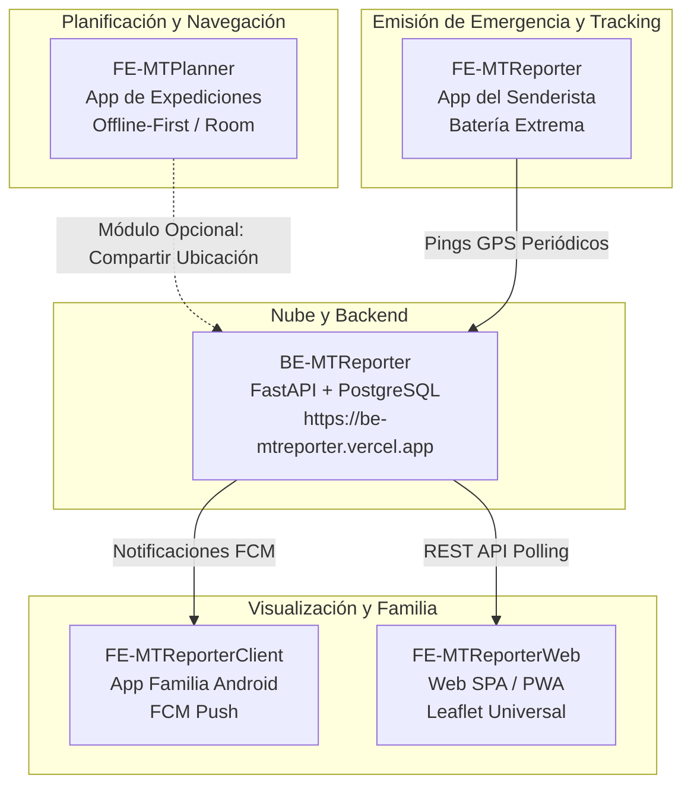
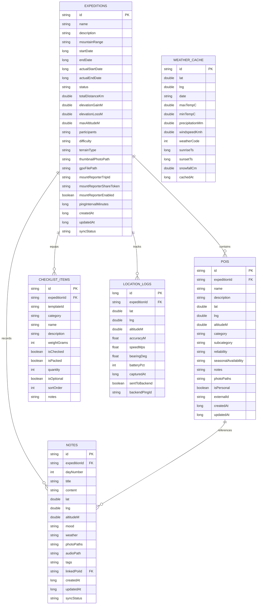
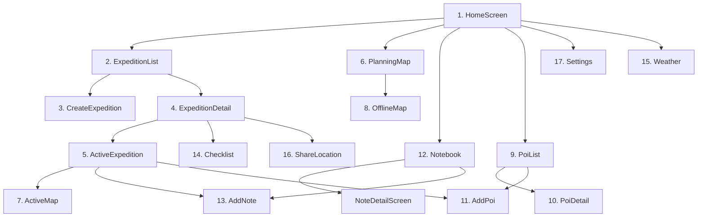

# AGENTS.md — FE-MTPlanner (App de Planificación de Expediciones)

> Este archivo es la **fuente de verdad** para cualquier agente de IA o desarrollador que trabaje sobre este repositorio.
> Léelo completo antes de inspeccionar o modificar cualquier archivo.

---

## 1. Qué es este proyecto

**MountPlanner** (`FE-MTPlanner`) es una aplicación nativa Android para la **planificación integral, navegación offline y diario de campo de expediciones de montaña**.

A diferencia de las herramientas tradicionales de senderismo o de las apps complementarias del ecosistema orientadas exclusivamente al seguimiento, MountPlanner es una herramienta autónoma concebida bajo la filosofía **Offline Total (Offline-First)**:
- Diseñada para funcionar al 100% de sus capacidades en alta montaña, sin necesidad de conexión a Internet ni cobertura móvil.
- Permite la creación y gestión completa de travesías (rutas, desniveles, fechas, participantes, dificultad).
- Integra mapas topográficos offline con OpenStreetMap mediante **Osmdroid** (sin API key de terceros ni costes).
- Cuenta con un catálogo exhaustivo de **Puntos de Interés (POIs)** categorizados en 22 tipos montañeros (fuentes de agua, refugios, vivacs, pasos peligrosos, collados, cimas, etc.) con fiabilidad y estacionalidad.
- Incluye un **Cuaderno de Campo Digital** con registro georreferenciado de impresiones, sensaciones, fotos, notas de voz y meteorología.
- Incorpora un gestor de **Checklists de Equipamiento** con control de peso en gramos, estado empaquetado y plantillas JSON precargadas para diferentes tipos de actividad.
- Permite consultar y cachear el pronóstico meteorológico de alta montaña para 7 días mediante la API abierta **Open-Meteo**.
- Proporciona un módulo **opcional** de compartición de ubicación en tiempo real con el ecosistema MountReporter.

---

## 2. El Ecosistema Completo (Contexto)

MountPlanner convive dentro del ecosistema general **MountReporter**, diseñado para la seguridad y el seguimiento de senderistas en montaña:

| Componente | Repositorio | Stack Tecnológico | Rol en el Ecosistema |
|---|---|---|---|
| **BE-MTReporter** | `../BE-MTReporter/` | Python 3.11+, FastAPI, PostgreSQL (asyncpg), Vercel Serverless | Backend central. Procesa pings, calcula métricas, gestiona tokens y envía notificaciones push FCM. |
| **FE-MTReporter** | `../FE-MTReporter/` | Android, Kotlin, Compose, WorkManager, Room, FusedLocation | App del senderista minimalista: emisión periódica de pings GPS con obsesión máxima por el ahorro de batería (< 2%/h). |
| **FE-MTReporterClient** | `../FE-MTReporterClient/` | Android, Kotlin, Compose, FCM, Google Maps/Osmdroid | App nativa de la familia en casa: recibe push notifications, muestra ruta y estadísticas mediante código de 5 caracteres. |
| **FE-MTReporterWeb** | `../FE-MTReporterWeb/` | Web SPA (HTML5, Vanilla JS, CSS3, Leaflet, PWA) | Visor universal multiplataforma para cualquier navegador web (móvil, tablet, PC) sin necesidad de instalación. |
| **FE-MTPlanner** *(este repo)* | — | Android, Kotlin, Jetpack Compose, Room, Hilt, Osmdroid, WorkManager | App integral de planificación de expediciones, navegación topográfica offline, POIs, cuaderno y checklist. |



---

## 3. Cómo MountPlanner se Integra con el Ecosistema

**La integración de MountPlanner con MountReporter es 100% OPCIONAL.**
MountPlanner no requiere un servidor para funcionar; toda la base de datos, el cálculo de distancias, los mapas guardados y los registros residen en el almacenamiento local del dispositivo.

Sin embargo, cuando el usuario va a iniciar una expedición y desea que sus familiares o contactos de seguridad puedan monitorizar su trayecto:
1. En la pantalla `ShareLocationScreen` o durante la creación de la expedición, el usuario activa la opción **"Compartir ubicación con MountReporter"**.
2. MountPlanner realiza una petición al backend (`POST /api/trips`) enviando el nombre de la expedición.
3. El backend devuelve un `trip_id` (UUID) y un `share_token` (código de 5 o 6 caracteres, ej: `X7K2P`).
4. MountPlanner almacena estos datos en la entidad de la expedición y en `AppPreferences` (DataStore).
5. Durante la marcha, el componente `LocationWorker` captura periódicamente la posición GPS e intenta enviarla al backend (`POST /api/ping`).
6. Si el dispositivo se queda sin cobertura (lo habitual en montaña), las coordenadas se encolan localmente en la tabla `location_logs`. En cuanto el dispositivo recupera señal de red, `SyncWorker` drena automáticamente la cola hacia el backend.
7. Los familiares pueden seguir el avance en tiempo real ingresando el `share_token` en **FE-MTReporterClient** o en **FE-MTReporterWeb**.

---

## 4. Stack Tecnológico Completo

| Tecnología | Versión | Propósito | Justificación técnica |
|---|---|---|---|
| **Kotlin** | 1.9.25 | Lenguaje principal | Moderno, seguro frente a nulos, interoperable y optimizado para Android. |
| **Android SDK** | minSdk 26, targetSdk 35 | Plataforma | minSdk 26 asegura compatibilidad con Android 8.0+ (95%+ de dispositivos activos). targetSdk 35 cumple los últimos estándares de Google Play. |
| **Jetpack Compose BOM** | 2024.09.00 | Interfaz de usuario | UI declarativa, reactiva, basada en componentes desacoplados y Material 3. |
| **Material 3** | Material Icons Extended | Diseño y componentes UI | Paleta visual adaptativa con tema oscuro para montaña y visibilidad exterior. |
| **Room** | 2.6.1 | Base de datos local SQLite | **Cerebro offline**. Persistencia de las 6 tablas principales con queries tipadas y soporte nativo para `Flow`. |
| **Hilt** | 2.52 | Inyección de dependencias | Inyección estándar de Android para repositorios, DAOs, workers y casos de uso. |
| **WorkManager** | 2.9.1 | Tareas en segundo plano | Ejecución garantizada y diferida de workers (`LocationWorker`, `SyncWorker`, `MapDownloadWorker`) incluso si el sistema mata el proceso. |
| **FusedLocationProviderClient** | play-services-location 21.3.0 | Captura GPS | Algoritmo optimizado de ubicación con gestión inteligente de precisión y batería. |
| **Osmdroid** | 6.1.18 | Mapas offline OpenStreetMap | Renderizado nativo de mapas cartográficos sin coste, sin API key, con soporte para caché local y polilíneas de ruta. |
| **Retrofit** | 2.11.0 | Cliente HTTP REST | Conexión con el backend MountReporter y con Open-Meteo. |
| **OkHttp** | 4.12.0 | Transporte HTTP | Gestión de timeouts, interceptores de logging y conexión de red eficiente. |
| **DataStore Preferences** | 1.1.1 | Preferencias clave-valor | Reemplazo reactivo y asíncrono de SharedPreferences para flags de configuración y expedición activa. |
| **MPAndroidChart** | 3.1.0 | Gráficas de elevación | Renderizado de perfiles altimétricos interactivos a partir de puntos de ruta GPX o registros. |
| **Open-Meteo API** | v1 REST | Pronóstico meteorológico | API pública, gratuita y sin clave de acceso para modelos meteorológicos de precisión. |
| **Coil Compose** | 2.7.0 | Carga de imágenes | Carga asíncrona y eficiente de fotos de campo tomadas en la ruta. |
| **Coroutines + Flow** | 1.8.1 | Concurrencia reactiva | Flujos de datos reactivos unidireccionales desde Room y sensores hacia la UI. |

---

## 5. Estructura de Directorios Completa

Package raíz: `com.mountplanner`
Ruta base del proyecto: `c:\Users\sintesp\OneDrive - MediaMarktSaturn\Documentos\GitHub\ProyectoMontaña\FE-MTPlanner`

```
FE-MTPlanner/
├── AGENTS.md                                   ← Este archivo (fuente de verdad del repositorio)
├── build.gradle.kts                            ← Script de construcción raíz
├── gradle.properties                           ← Parámetros de la JVM y configuración de Gradle
├── settings.gradle.kts                         ← Inclusión de módulos y repositorios Maven
├── gradle/
│   └── libs.versions.toml                      ← Version Catalog centralizado de dependencias
│
└── app/
    ├── build.gradle.kts                        ← Configuración de plugins, SDKs, Room, Hilt, Compose
    ├── proguard-rules.pro                      ← Reglas de ofuscación y optimización R8/ProGuard
    └── src/main/
        ├── AndroidManifest.xml                 ← Permisos (GPS, red, arranque), Application y Service
        ├── assets/
        │   └── checklists/                     ← Plantillas preconfiguradas de equipamiento (JSON)
        │       ├── senderismo_dia.json         ← Checklist para excursiones de 1 día
        │       ├── gr_largo.json               ← Checklist para travesías de media/larga distancia
        │       ├── alta_montana_verano.json    ← Checklist para ascensiones estivales
        │       └── alta_montana_invierno.json  ← Checklist para alpinismo y terreno invernal
        │
        └── java/com/mountplanner/
            ├── MainActivity.kt                 ← Activity única anfitriona del NavGraph Compose
            ├── MountPlannerApplication.kt      ← Clase Application con @HiltAndroidApp y canales
            │
            ├── core/                           ← Utilidades nucleares, inyección y servicios base
            │   ├── HaversineCalculator.kt      ← Fórmulas geodésicas offline: distancia, desnivel +/-
            │   ├── di/                         ← Módulos de inyección de dependencias Hilt
            │   │   ├── AppModule.kt            ← Contexto, Gson, CoroutineScope global
            │   │   ├── DatabaseModule.kt       ← Room DB Singleton y provisión de los 6 DAOs
            │   │   ├── NetworkModule.kt        ← Clientes OkHttp y Retrofit (MountReporter + Weather)
            │   │   └── WorkerModule.kt         ← Configuración de HiltWorkerFactory
            │   ├── export/                     ← Gestión de ficheros GPX
            │   │   ├── GpxExporter.kt          ← Generador de archivos XML GPX 1.1 con track y waypoints
            │   │   └── GpxParser.kt            ← Parser XML Pull para importar tracks y waypoints GPX
            │   ├── location/
            │   │   └── LocationManager.kt      ← Wrapper reactivo sobre FusedLocationProviderClient
            │   ├── notification/
            │   │   └── NotificationHelper.kt   ← Canales de notificación y ForegroundInfo para Workers
            │   ├── offline/
            │   │   └── ConnectivityObserver.kt ← Monitor reactivo del estado de la red (WiFi/Móvil)
            │   ├── prefs/
            │   │   └── AppPreferences.kt       ← DataStore Preferences (trip_id, unidades, flags)
            │   └── receiver/
            │       └── BootReceiver.kt         ← BroadcastReceiver para reprogramar Workers al reiniciar
            │
            ├── data/                           ← Capa de datos (Room, API, Modelos, Repositorios)
            │   ├── local/                      ← Base de datos SQLite Room
            │   │   ├── MountPlannerDatabase.kt ← Definición de RoomDatabase con sus 6 entidades
            │   │   ├── dao/                    ← Data Access Objects
            │   │   │   ├── ChecklistDao.kt     ← Consultas y mutaciones de items de material
            │   │   │   ├── Daos.kt             ← Interfaces base y consultas agrupadas
            │   │   │   ├── ExpeditionDao.kt    ← CRUD de expediciones y filtro por estado
            │   │   │   ├── LocationLogDao.kt   ← Registro de puntos GPS y control de sincronización
            │   │   │   ├── NoteDao.kt          ← CRUD del cuaderno de campo digital
            │   │   │   ├── PoiDao.kt           ← Búsquedas de POIs por expedición y categoría
            │   │   │   └── WeatherCacheDao.kt  ← Almacenamiento y consulta de predicciones meteorológicas
            │   │   └── entity/                 ← Entidades mapeadas a tablas SQLite
            │   │       ├── ChecklistItemEntity.kt ← Tabla "checklist_items"
            │   │       ├── Entities.kt         ← Entidades auxiliares / ligeras
            │   │       ├── ExpeditionEntity.kt ← Tabla "expeditions"
            │   │       ├── LocationLogEntity.kt← Tabla "location_logs"
            │   │       ├── NoteEntity.kt       ← Tabla "notes" (field notes)
            │   │       ├── PoiEntity.kt        ← Tabla "pois" (points of interest)
            │   │       └── WeatherCacheEntity.kt ← Tabla "weather_cache"
            │   │
            │   ├── model/                      ← Modelos de dominio limpios y mappers (toEntity / toDomain)
            │   │   ├── ChecklistItem.kt        ← Modelo de item de equipamiento
            │   │   ├── Expedition.kt           ← Modelo de expedición de montaña
            │   │   ├── LocationPoint.kt        ← Modelo de punto geográfico con altitud
            │   │   ├── Note.kt                 ← Modelo de nota de campo con metadatos
            │   │   ├── Poi.kt                  ← Modelo de POI con el enum de 22 categorías
            │   │   └── WeatherData.kt          ← Modelo de reporte y pronóstico meteorológico
            │   │
            │   ├── remote/                     ← Conexiones HTTP externas
            │   │   ├── ApiClient.kt            ← Factoría de llamadas Retrofit
            │   │   ├── MountReporterApiService.kt ← Interfaz Retrofit para backend MountReporter
            │   │   ├── WeatherApiService.kt    ← Interfaz Retrofit para Open-Meteo
            │   │   └── model/                  ← DTOs de petición y respuesta JSON
            │   │       ├── MountReporterModels.kt ← Modelos serializables para MountReporter API
            │   │       └── WeatherApiModels.kt    ← Modelos serializables para Open-Meteo API
            │   │
            │   └── repository/                 ← Repositorios con patrón Single Source of Truth
            │       ├── ChecklistRepository.kt  ← Persistencia de checklist y carga de plantillas JSON
            │       ├── ExpeditionRepository.kt ← Coordinación de travesías, estado y métricas
            │       ├── LocationRepository.kt   ← Flujo de puntos GPS y drenaje de cola offline
            │       ├── NoteRepository.kt       ← Gestión de notas, imágenes y notas de audio
            │       ├── PoiRepository.kt        ← Gestión y ordenación geoespacial de POIs
            │       └── WeatherRepository.kt    ← Consulta online y fallback a caché SQLite local
            │
            ├── domain/                         ← Capa de negocio (Casos de uso independientes)
            │   └── usecase/
            │       ├── AddPoiUseCase.kt                ← Lógica de inserción y validación de POIs
            │       ├── CreateExpeditionUseCase.kt      ← Validación, parseo de GPX e inicialización
            │       ├── ExportGpxUseCase.kt             ← Exportación a fichero .gpx para compartir
            │       ├── FinishExpeditionUseCase.kt      ← Cierre de expedición, cálculo de totales
            │       ├── GetNearbyPoisUseCase.kt         ← Filtrado Haversine de POIs por radio km
            │       ├── ShareLocationUseCase.kt         ← Registro opcional en backend MountReporter
            │       ├── StartActiveExpeditionUseCase.kt ← Activación de tracking y arranque de Workers
            │       └── SyncPendingPingsUseCase.kt      ← Envío en lote de pings pendientes al backend
            │
            ├── ui/                             ← Capa de presentación (Jetpack Compose + MVVM)
            │   ├── checklist/
            │   │   ├── ChecklistScreen.kt      ← Pantalla interactiva de equipamiento y peso
            │   │   └── ChecklistViewModel.kt   ← Estado y manipulación de items
            │   ├── expedition/
            │   │   ├── active/
            │   │   │   ├── ActiveExpeditionScreen.kt    ← Panel durante la marcha activa
            │   │   │   └── ActiveExpeditionViewModel.kt ← Métricas en tiempo real y controles
            │   │   ├── create/
            │   │   │   ├── CreateExpeditionScreen.kt    ← Formulario de creación de expedición
            │   │   │   └── CreateExpeditionViewModel.kt ← Estado de formulario y carga de GPX
            │   │   ├── detail/
            │   │   │   ├── ExpeditionDetailScreen.kt    ← Ficha completa con perfil altimétrico
            │   │   │   └── ExpeditionDetailViewModel.kt ← Carga de detalles y estadísticas
            │   │   └── list/
            │   │       ├── ExpeditionListScreen.kt      ← Lista de travesías por estado
            │   │       └── ExpeditionListViewModel.kt   ← Filtrado y selector de expediciones
            │   ├── home/
            │   │   ├── HomeScreen.kt           ← Dashboard principal de inicio
            │   │   └── HomeViewModel.kt        ← Resumen de expedición activa y accesos rápidos
            │   ├── map/
            │   │   ├── ActiveMapScreen.kt      ← Mapa centrado en GPS con polilínea en vivo
            │   │   ├── MapViewModel.kt         ← Estado de capas, zoom y selección de POIs
            │   │   ├── OfflineMapScreen.kt     ← Selector de área para descarga de tiles
            │   │   ├── OsmdroidMapView.kt      ← AndroidView Compose para envolver MapView de OSM
            │   │   └── PlanningMapScreen.kt    ← Mapa de planificación con visor de track GPX
            │   ├── navigation/
            │   │   ├── MountPlannerNavGraph.kt ← NavHost general con BottomBar y transiciones
            │   │   └── Screen.kt               ← Sealed class con todas las rutas y argumentos
            │   ├── notebook/
            │   │   ├── AddNoteScreen.kt        ← Formulario para nueva nota georreferenciada
            │   │   ├── NoteDetailScreen.kt     ← Vista de detalle de una nota con foto/audio
            │   │   ├── NotebookScreen.kt       ← Lista cronológica de notas de la travesía
            │   │   └── NotebookViewModel.kt    ← Gestión de notas de campo
            │   ├── poi/
            │   │   ├── AddPoiScreen.kt         ← Selector de categoría y registro de POI
            │   │   ├── PoiDetailScreen.kt      ← Ficha detallada de un punto de interés
            │   │   ├── PoiListScreen.kt        ← Lista ordenada por distancia o categoría
            │   │   └── PoiViewModel.kt         ← Filtrado y cálculo de distancias
            │   ├── settings/
            │   │   ├── SettingsScreen.kt       ← Unidades de medida, gestión de mapas y caché
            │   │   └── SettingsViewModel.kt    ← Persistencia en DataStore
            │   ├── sharing/
            │   │   ├── ShareLocationScreen.kt  ← Gestión del enlace opcional con MountReporter
            │   │   └── ShareLocationViewModel.kt ← Creación de travesía remota y share_token
            │   ├── theme/
            │   │   ├── Color.kt                ← Paleta de colores de montaña (pizarra, musgo, alerta)
            │   │   ├── Theme.kt                ← Configuración de MaterialTheme oscuro/claro
            │   │   └── Type.kt                 ← Tipografía deportiva y técnica
            │   └── weather/
            │       ├── WeatherScreen.kt        ← Pronóstico de montaña 7 días con gráficas
            │       └── WeatherViewModel.kt     ← Consulta a Open-Meteo y fallback SQLite
            │
            └── worker/                         ← Background Workers (WorkManager)
                ├── LocationWorker.kt           ← Captura periódica de GPS en marcha y guardado local
                ├── MapDownloadWorker.kt        ← Descarga por lotes de tiles OSM para offline
                └── SyncWorker.kt               ← Drenaje de pings acumulados hacia el backend
```

---

## 6. Package y Convenciones de Nombres

- **Package Name Oficial:** `com.mountplanner`
- **Application ID:** `com.mountplanner`
- **Clase Application:** `com.mountplanner.MountPlannerApplication`
- **MainActivity:** `com.mountplanner.MainActivity`
- **URL Base MountReporter Backend:** `https://be-mtreporter.vercel.app` (definida en `BuildConfig.MOUNT_REPORTER_BASE_URL`)
- **URL Base Open-Meteo:** `https://api.open-meteo.com/`

### Convenciones de Nombres
- Entidades Room: Sufijo `Entity` (ej: `ExpeditionEntity`, `PoiEntity`, `NoteEntity`).
- Modelos de Dominio: Nombres limpios (ej: `Expedition`, `Poi`, `Note`, `ChecklistItem`).
- DAOs Room: Sufijo `Dao` (ej: `ExpeditionDao`, `PoiDao`, `ChecklistDao`).
- Repositorios: Sufijo `Repository` (ej: `ExpeditionRepository`, `PoiRepository`).
- Casos de Uso: Sufijo `UseCase` en infinitivo o imperativo (ej: `CreateExpeditionUseCase`, `GetNearbyPoisUseCase`).
- Pantallas Compose: Sufijo `Screen` (ej: `HomeScreen`, `ActiveMapScreen`).
- ViewModels: Sufijo `ViewModel` (ej: `HomeViewModel`, `MapViewModel`).
- Workers: Sufijo `Worker` (ej: `LocationWorker`, `SyncWorker`, `MapDownloadWorker`).

---

## 7. Esquema de Base de Datos Room

La base de datos local SQLite se gestiona mediante Room a través de `MountPlannerDatabase` (`mount_planner.db`). Comprende **6 tablas principales**:



### Detalle de Tablas y Columnas

#### 1. `expeditions` (`ExpeditionEntity`)
Almacena todas las travesías y salidas a la montaña creadas por el usuario.
- `id` (String, PK, UUID): Identificador único de la expedición.
- `name` (String): Nombre descriptivo (ej: "Aneto por Coronas", "GR-11 Etapa 4").
- `description` (String?): Objetivos, notas previas, plan de contingencia.
- `mountainRange` (String?): Macizo o cordillera (ej: "Pirineos", "Picos de Europa", "Sierra Nevada").
- `startDate` / `endDate` (Long?): Timestamps UNIX de fechas previstas.
- `actualStartDate` / `actualEndDate` (Long?): Timestamps reales al iniciar/finalizar la marcha.
- `status` (String): Estado de la expedición: `"planning"`, `"active"`, `"finished"`, `"cancelled"`.
- `totalDistanceKm` (Double?): Distancia calculada o estimada en kilómetros.
- `elevationGainM` / `elevationLossM` (Double?): Desnivel acumulado positivo y negativo en metros.
- `maxAltitudeM` (Double?): Altitud máxima alcanzada o prevista en metros.
- `participants` (String?): Lista de integrantes serializada en JSON (ej: `["Yo", "Marta", "Carlos"]`).
- `difficulty` (String?): Grado de dificultad: `"easy"`, `"moderate"`, `"hard"`, `"expert"`.
- `terrainType` (String?): Tipo de terreno (ej: "Sendero", "Tartera", "Cresta", "Glaciar").
- `thumbnailPhotoPath` (String?): Ruta a imagen representativa.
- `gpxFilePath` (String?): Ruta local del track GPX importado o generado.
- `mountReporterTripId` (String?): UUID asignado por el backend MountReporter si se vinculó.
- `mountReporterShareToken` (String?): Código alfanumérico de 5-6 caracteres para compartir con la familia.
- `mountReporterEnabled` (Boolean): Flag que indica si la emisión de pings está activa.
- `pingIntervalMinutes` (Long): Intervalo de envío de pings (15, 30, 60 min).
- `createdAt` / `updatedAt` (Long): Timestamps de auditoría.
- `syncStatus` (String): Estado de sincronización local: `"local"`, `"synced"`, `"pending_sync"`.

#### 2. `pois` (`PoiEntity` / `points_of_interest`)
Puntos singulares de interés cartográfico y de seguridad montañera.
- `id` (String, PK, UUID): Identificador único del POI.
- `expeditionId` (String?, FK): ID de expedición asociada o null si es un POI global reutilizable.
- `name` (String): Nombre del punto (ej: "Fuente de la Ribereta", "Refugio de Góriz").
- `description` (String?): Información detallada de acceso o precauciones.
- `lat` / `lng` (Double): Coordenadas geográficas WGS84.
- `altitudeM` (Double?): Altitud sobre el nivel del mar en metros.
- `category` (String): Una de las 22 categorías del enum `PoiCategory`.
- `subcategory` (String?): Especificación adicional (ej: "Libre", "Guardado", "Manantial").
- `reliability` (String): Grado de confianza: `"verified"` (comprobado en persona), `"reported"` (por terceros), `"uncertain"` (sin confirmar).
- `seasonalAvailability` (String?): Régimen temporal (ej: "Solo de mayo a octubre", "Seco a finales de verano").
- `notes` (String?): Notas complementarias de campo.
- `photoPaths` (String?): Array JSON con rutas a fotografías locales.
- `isPersonal` (Boolean): True si fue creado por el usuario.
- `externalId` (String?): Referencia de fuentes externas (OpenStreetMap node, IGN, etc.).
- `createdAt` / `updatedAt` (Long): Timestamps de control.

#### 3. `notes` (`NoteEntity` / `field_notes`)
Entradas del cuaderno de campo digital registrado durante la ruta.
- `id` (String, PK, UUID): Identificador único de la nota.
- `expeditionId` (String?, FK): Expedición a la que pertenece la nota.
- `dayNumber` (Int?): Número de jornada (1, 2, 3...) en expediciones multietapa.
- `title` (String): Título o resumen de la anotación.
- `content` (String): Texto libre con impresiones, estado del terreno o reflexiones.
- `lat` / `lng` (Double?): Coordenadas GPS en el momento de escribir la nota.
- `altitudeM` (Double?): Altitud registrada en el momento.
- `mood` (String?): Estado anímico: `"great"`, `"good"`, `"tired"`, `"difficult"`, `"scared"`.
- `weather` (String?): Clima observado: `"sunny"`, `"cloudy"`, `"rainy"`, `"stormy"`, `"snow"`.
- `photoPaths` (String?): Array JSON con fotos tomadas junto a la nota.
- `audioPath` (String?): Ruta a nota de voz grabada.
- `tags` (String?): Etiquetas temáticas en JSON (ej: `["fauna", "geología", "incidencia"]`).
- `linkedPoiId` (String?, FK): Referencia opcional a un POI cercano.
- `createdAt` / `updatedAt` (Long): Timestamps de creación y última edición.
- `syncStatus` (String): Estado de sincronización.

#### 4. `checklist_items` (`ChecklistItemEntity`)
Material de montaña, peso y verificación de equipaje.
- `id` (String, PK, UUID): Identificador único del item.
- `expeditionId` (String?, FK): Expedición asociada o null si es parte de una plantilla.
- `templateId` (String?): Identificador de la plantilla de origen.
- `category` (String): Grupo de material (`"navigation"`, `"shelter"`, `"clothing"`, `"food"`, `"safety"`, `"technical"`).
- `name` (String): Nombre del elemento (ej: "Crampones semiautomáticos", "Filtro de agua", "Chaqueta Gore-Tex").
- `description` (String?): Modelo, talla o especificación técnica.
- `weightGrams` (Int?): Peso individual en gramos para cálculo de carga de la mochila.
- `isChecked` (Boolean): Seleccionado para incluir en esta expedición.
- `isPacked` (Boolean): Ya guardado físicamente dentro de la mochila.
- `quantity` (Int): Número de unidades.
- `isOptional` (Boolean): Si es material prescindible según la meteo.
- `sortOrder` (Int): Orden de visualización en la interfaz.
- `notes` (String?): Notas de mantenimiento o comprobación de pilas.

#### 5. `location_logs` (`LocationLogEntity`)
Historial de puntos GPS capturados por el dispositivo durante las travesías activas.
- `id` (Long, PK, autoincrement): Identificador secuencial.
- `expeditionId` (String, FK): Expedición a la que pertenece el punto.
- `lat` / `lng` (Double): Coordenadas geográficas.
- `altitudeM` (Double?): Altitud barométrica o GPS en metros.
- `accuracyM` (Float?): Precisión horizontal estimada en metros.
- `speedMps` (Float?): Velocidad en metros por segundo.
- `bearingDeg` (Float?): Rumbo en grados sexagesimales (0-360°).
- `batteryPct` (Int?): Nivel de batería del dispositivo en el momento (0-100%).
- `capturedAt` (Long): Timestamp UNIX exacto de la captura.
- `sentToBackend` (Boolean): True si ya se transmitió a MountReporter con éxito.
- `backendPingId` (String?): Identificador retornado por el servidor remoto.

#### 6. `weather_cache` (`WeatherCacheEntity`)
Caché local de pronósticos meteorológicos para consulta sin conexión.
- `id` (String, PK): Clave compuesta, típicamente `"{lat}_{lng}_{YYYY-MM-DD}"`.
- `lat` / `lng` (Double): Coordenadas de la predicción.
- `date` (String): Fecha en formato ISO `YYYY-MM-DD`.
- `maxTempC` / `minTempC` (Double): Temperaturas máxima y mínima en grados Celsius.
- `precipitationMm` (Double): Acumulación diaria estimada de lluvia en mm.
- `windspeedKmh` (Double): Velocidad máxima de ráfagas de viento en km/h.
- `weatherCode` (Int): Código numérico meteorológico WMO de Open-Meteo.
- `sunriseTs` / `sunsetTs` (Long): Timestamps de salida y puesta de sol (vital para planificar luz diurna).
- `snowfallCm` (Double): Nieve nueva estimada en centímetros.
- `cachedAt` (Long): Timestamp UNIX de cuándo se descargó la previsión.

---

## 8. Pantallas de la Aplicación

La aplicación se compone de **17 pantallas** organizadas mediante `MountPlannerNavGraph`:



### Catálogo de Pantallas y Funcionalidades

1. **`HomeScreen` (`ui/home/HomeScreen.kt`)**
   - **ViewModel:** `HomeViewModel`
   - **Ruta:** `Screen.Home` (`"home"`)
   - **Propósito:** Tablero de mando principal. Si hay una expedición activa, muestra su estado en tiempo real (tiempo en marcha, distancia, desnivel y botón directo para volver a ella). Si no hay expedición en curso, muestra la próxima expedición planificada, accesos directos al mapa, cuaderno, POIs y resumen del tiempo.

2. **`ExpeditionListScreen` (`ui/expedition/list/ExpeditionListScreen.kt`)**
   - **ViewModel:** `ExpeditionListViewModel`
   - **Ruta:** `Screen.Expeditions` (`"expeditions"`)
   - **Propósito:** Lista exhaustiva de travesías organizadas por pestañas según su estado: *Planificadas*, *Activas*, *Finalizadas*. Incluye tarjetas con métricas visuales (desnivel, distancia, fotos) y botón de acción flotante (FAB) para crear una nueva expedición.

3. **`CreateExpeditionScreen` (`ui/expedition/create/CreateExpeditionScreen.kt`)**
   - **ViewModel:** `CreateExpeditionViewModel`
   - **Ruta:** `Screen.CreateExpedition` (`"expedition/create"`)
   - **Propósito:** Asistente de planificación: nombre, cordillera, fechas estimadas, selector de dificultad, integrantes, importación de track GPX existente, selección de plantilla de checklist inicial y switch para habilitar compartición con MountReporter.

4. **`ExpeditionDetailScreen` (`ui/expedition/detail/ExpeditionDetailScreen.kt`)**
   - **ViewModel:** `ExpeditionDetailViewModel`
   - **Ruta:** `Screen.ExpeditionDetail` (`"expedition/{expeditionId}"`)
   - **Propósito:** Vista integral de una expedición: gráfica de perfil altimétrico interactiva (MPAndroidChart), mapa resumen de la ruta, lista de POIs que se visitarán, avance del checklist de material, notas registradas y botón principal **"Iniciar Expedición"**.

5. **`ActiveExpeditionScreen` (`ui/expedition/active/ActiveExpeditionScreen.kt`)**
   - **ViewModel:** `ActiveExpeditionViewModel`
   - **Ruta:** `Screen.ActiveExpedition` (`"expedition/active"`)
   - **Propósito:** Interfaz de navegación durante la marcha de alta montaña: cronómetro en vivo, altitud instantánea, desnivel positivo acumulado, velocidad media, botón de acceso rápido para añadir nota o marcar POI in situ, botón de "Acampo Aquí / Pausar" y botón para concluir la expedición.

6. **`PlanningMapScreen` (`ui/map/PlanningMapScreen.kt`)**
   - **ViewModel:** `MapViewModel`
   - **Ruta:** `Screen.Map` (`"map/{expeditionId}"`)
   - **Propósito:** Mapa topográfico general con Osmdroid para explorar rutas, superponer tracks GPX planificados, inspeccionar curvas de nivel y ver todos los POIs de la zona.

7. **`ActiveMapScreen` (`ui/map/ActiveMapScreen.kt`)**
   - **ViewModel:** `MapViewModel`
   - **Ruta:** Pantalla modal integrada en la expedición activa.
   - **Propósito:** Mapa centrado en la posición GPS actual del usuario en tiempo real. Dibuja la polilínea del recorrido que se va realizando, resalta los POIs cercanos con sus distancias Haversine e incluye botón de centrado y brújula.

8. **`OfflineMapScreen` (`ui/map/OfflineMapScreen.kt`)**
   - **ViewModel:** `MapViewModel`
   - **Ruta:** `Screen.OfflineMap` (`"map/offline"`)
   - **Propósito:** Descargador de cartografía offline. Permite delimitar un rectángulo geográfico sobre el mapa, seleccionar rango de zoom (ej: niveles 10 a 16), calcular el número estimado de tiles y espacio en megabytes, e iniciar la descarga en background mediante `MapDownloadWorker`.

9. **`PoiListScreen` (`ui/poi/PoiListScreen.kt`)**
   - **ViewModel:** `PoiViewModel`
   - **Ruta:** `Screen.Pois` (`"pois"`)
   - **Propósito:** Buscador y catálogo de puntos de interés. Permite filtrar por las 22 categorías, buscar por nombre y ordenar automáticamente por distancia respecto a la ubicación GPS actual.

10. **`PoiDetailScreen` (`ui/poi/PoiDetailScreen.kt`)**
    - **ViewModel:** `PoiViewModel`
    - **Ruta:** `Screen.PoiDetail` (`"poi/{poiId}"`)
    - **Propósito:** Ficha técnica del POI: coordenadas exactas, altitud, nivel de fiabilidad, advertencias de estacionalidad (ej: si una fuente se seca en verano), fotos asociadas y botón para centrar en el mapa o trazar rumbo.

11. **`AddPoiScreen` (`ui/poi/AddPoiScreen.kt`)**
    - **ViewModel:** `PoiViewModel`
    - **Ruta:** `Screen.AddPoi` (`"poi/add?lat={lat}&lng={lng}"`)
    - **Propósito:** Registrar un nuevo punto en el terreno: selector de categoría con iconos y emojis, nombre, descripción, captura de coordenadas actuales del GPS o punto seleccionado en el mapa, y cámara para fotos.

12. **`NotebookScreen` (`ui/notebook/NotebookScreen.kt`)**
    - **ViewModel:** `NotebookViewModel`
    - **Ruta:** `Screen.Notebook` (`"notebook"`)
    - **Propósito:** Cuaderno de bitácora de la expedición. Cronología de anotaciones organizadas por jornada, con miniaturas de fotos, estado de ánimo y condiciones meteorológicas registradas.

13. **`AddNoteScreen` (`ui/notebook/AddNoteScreen.kt`)**
    - **ViewModel:** `NotebookViewModel`
    - **Ruta:** `Screen.AddNote` (`"note/add?expeditionId={expeditionId}"`)
    - **Propósito:** Redacción de una nueva nota de campo: captura automática de posición y altitud, selector de sensaciones (mood emojis), selector de clima, grabación de notas de voz cortas y adjuntos de fotos.

14. **`ChecklistScreen` (`ui/checklist/ChecklistScreen.kt`)**
    - **ViewModel:** `ChecklistViewModel`
    - **Ruta:** `Screen.Checklist` (`"checklist/{expeditionId}"`)
    - **Propósito:** Lista de equipaje interactiva con dos niveles de marcado: "Planificado para llevar" (`isChecked`) y "Guardado en la mochila" (`isPacked`). Muestra el desglose del peso total en gramos por categorías (abrigo, comida, seguridad, material técnico). Permite cargar plantillas JSON predefinidas.

15. **`WeatherScreen` (`ui/weather/WeatherScreen.kt`)**
    - **ViewModel:** `WeatherViewModel`
    - **Ruta:** `Screen.Weather` (`"weather/{expeditionId}"`)
    - **Propósito:** Pronóstico meteorológico de montaña de 7 días vía Open-Meteo. Incluye temperaturas mín/máx, probabilidad y mm de precipitación, acumulación de nieve, ráfagas de viento y horas de luz diurna (amanecer/atardecer). Si no hay red, carga la última versión almacenada en `weather_cache`.

16. **`ShareLocationScreen` (`ui/sharing/ShareLocationScreen.kt`)**
    - **ViewModel:** `ShareLocationViewModel`
    - **Ruta:** `Screen.ShareLocation` (`"share/{expeditionId}"`)
    - **Propósito:** Panel de compartición de ubicación con el ecosistema MountReporter. Muestra el código de vinculación familiar (`share_token`), enlace web directo, selector de intervalo de emisión de pings y estado de la sincronización en background.

17. **`SettingsScreen` (`ui/settings/SettingsScreen.kt`)**
    - **ViewModel:** `SettingsViewModel`
    - **Ruta:** `Screen.Settings` (`"settings"`)
    - **Propósito:** Ajustes generales de la aplicación: unidades de medida métricas o imperiales (km/mi, m/ft, °C/°F), gestión del almacenamiento de mapas offline descargados, intervalo de GPS por defecto y políticas de ahorro de energía.

---

## 9. Funcionalidades Clave y Arquitectura

### 9.1. Modo Offline TOTAL (Room SQLite)
Toda la aplicación está gobernada por el principio **Single Source of Truth** centrado en la base de datos local Room.
- Ninguna pantalla de la UI espera respuestas de la red para renderizarse.
- Todas las consultas retornan `Flow<T>`, lo que garantiza reactividad inmediata cuando cualquier dato cambia en SQLite.
- Cuando hay conexión disponible, los repositorios refrescan la caché local en background de manera transparente.

### 9.2. Mapas Offline con Osmdroid
- **Librería:** `org.osmdroid:osmdroid-android:6.1.18`.
- No requiere claves de API, registro ni costes de uso (OpenStreetMap / Mapnik).
- El visor `OsmdroidMapView` está encapsulado en un `AndroidView` de Compose gestionando su ciclo de vida (`onResume`, `onPause`).
- `MapDownloadWorker` permite descargar bloques de tiles en background para conservarlos en el almacenamiento interno o en tarjeta SD, garantizando cartografía visible en valles profundos y cumbres remotas sin cobertura.

### 9.3. Catálogo de POIs con 22 Categorías
El enum `PoiCategory` define 22 tipos de puntos adaptados a la realidad de la montaña:

| Categoría Enum | Etiqueta | Emoji | Descripción |
|---|---|---|---|
| `PEAK` | Cima / Pico | ⛰️ | Cumbre principal, cota o vértice geodésico |
| `WATER_SOURCE` | Fuente de Agua | 💧 | Manantial, fuente, torrente potable |
| `CAMP` | Campamento | ⛺ | Zona óptima para plantar tienda de campaña |
| `HUT` | Refugio Guardado | 🛖 | Refugio con servicios y guardas |
| `PASS` | Collado / Puerto | 🏔️ | Paso entre valles o brecha |
| `VIEWPOINT` | Mirador | 👁️ | Punto panorámico destacado |
| `DANGER` | Paso Peligroso | ⚠️ | Paso expuesto, caída de piedras, rimaya |
| `PARKING` | Aparcamiento | 🅿️ | Punto de estacionamiento del vehículo |
| `TRAILHEAD` | Inicio de Sendero | 🥾 | Comienzo señalizado de la ruta |
| `SHELTER` | Refugio Libre | 🏚️ | Cabaña o caseta de emergencia no guardada |
| `CROSSING` | Vadeo de Río | 🌊 | Cruce de cauce de agua o pasarela |
| `CAVE` | Cueva / Abrigo | 🕳️ | Cueva natural o abrigo rocoso |
| `SCENIC` | Punto Escénico | 📸 | Lugar de interés fotográfico o paisajístico |
| `FOOD` | Aprovisionamiento | 🍔 | Pueblo, albergue o venta de víveres |
| `WILDLIFE` | Fauna | 🦌 | Zona habitual de avistamiento de fauna |
| `MEDICAL` | Punto de Auxilio | ⚕️ | Botiquín público, puesto de socorro |
| `INFO` | Cartel Informativo | ℹ️ | Panel del parque natural o señalética |
| `CHECKPOINT` | Punto de Control | 📍 | Hito kilométrico o referencia de navegación |
| `RESCUE` | Helisuperficie | 🚁 | Punto despejado para evacuación en helicóptero |
| `BIVOUAC` | Vivac | 🏕️ | Zona abrigada para dormir al raso |
| `GLACIER` | Glaciar / Nevero | 🧊 | Masa de hielo permanente o nevero tardío |
| `OTHER` | Otro | 🔹 | Cualquier otro punto relevante |

Cada POI incluye fiabilidad (`verified`, `reported`, `uncertain`) y régimen estacional (`seasonalAvailability`).

### 9.4. Cuaderno de Campo Digital
Permite al montañero registrar sensaciones técnicas y personales:
- Coordenadas geográficas y altitud registradas automáticamente desde el GPS en el instante de redacción.
- Registro del estado físico y anímico (`mood`) y del clima instantáneo (`weather`).
- Vinculación opcional a un POI cercano y soporte para notas de voz y fotografías locales.

### 9.5. Checklist de Equipamiento y Plantillas JSON
- Las listas de material se organizan por categorías funcionales (`navigation`, `shelter`, `clothing`, `food`, `safety`, `technical`).
- Sistema de doble verificación: marcado para incluir (`isChecked`) y guardado en la mochila (`isPacked`).
- Cálculo en tiempo real del peso total en gramos de la mochila para control de carga.
- 4 plantillas JSON precargadas en `assets/checklists/`:
  - `senderismo_dia.json`: Excursiones de media jornada o jornada completa sin pernocta.
  - `gr_largo.json`: Travesías de gran recorrido con varios días de marcha.
  - `alta_montana_verano.json`: Ascensiones a tresmiles en época estival.
  - `alta_montana_invierno.json`: Terreno invernal con piolet, crampones, ARVA, pala y sonda.

### 9.6. Meteorología con Caché Offline (Open-Meteo)
- Consulta directa a `https://api.open-meteo.com/v1/forecast` sin API keys ni costes.
- Extrae parámetros cruciales para montañismo: temperatura mín/máx a 2m, lluvia acumulada (mm), nieve acumulada (cm), velocidad máxima del viento (km/h), código meteorológico WMO y horas de amanecer y atardecer.
- Toda predicción obtenida se guarda en la tabla `weather_cache`. Si durante la ruta no hay conectividad móvil, la app muestra la predicción cacheada indicando la hora en que se descargó.

### 9.7. Exportación e Importación GPX
- **`GpxExporter`:** Genera ficheros conformes con el estándar GPX 1.1 incluyendo etiquetas `<trk>`, `<trkseg>`, `<trkpt>` con latitud, longitud, `<ele>` (elevación) y `<time>`, así como `<wpt>` para los POIs.
- **`GpxParser`:** Lee archivos GPX mediante XmlPullParser con bajo consumo de memoria, extrayendo los trackpoints y waypoints para dibujarlos en el mapa e integrarlos en la planificación.

### 9.8. Cálculo Haversine Offline
El objeto `HaversineCalculator` ejecuta cálculos trigonométricos sobre el elipsoide terrestre sin depender de librerías externas:
- Distancia lineal entre coordenadas en kilómetros.
- Distancia total acumulada de una lista de puntos GPS.
- Ganancia acumulada de desnivel positivo ($D+$) y pérdida de desnivel negativo ($D-$), filtrando fluctuaciones menores.
- Ordenación de listas de POIs por proximidad a la posición del usuario.

---

## 10. API Contract con MountReporter (Módulo Opcional de Compartir)

Cuando el montañero activa la compartición con MountReporter, la app se comunica con los siguientes endpoints del backend (`https://be-mtreporter.vercel.app`):

### 10.1. Crear Travesía Remota
```http
POST /api/trips
Content-Type: application/json

{
  "name": "Aneto por Coronas"
}
```
**Respuesta:** `200 OK`
```json
{
  "id": "b3e21e78-9a84-4821-bc72-132d7f8d09aa",
  "share_token": "X7K2P"
}
```
*MountPlanner guarda `id` en `mountReporterTripId` y `share_token` en `mountReporterShareToken`.*

### 10.2. Enviar Ping Periódico de Ubicación
```http
POST /api/ping
Content-Type: application/json

{
  "trip_id": "b3e21e78-9a84-4821-bc72-132d7f8d09aa",
  "lat": 42.632145,
  "lng": 0.657812,
  "alt": 2840.5,
  "battery": 82
}
```
**Respuesta:** `200 OK`
```json
{
  "status": "ok",
  "ping_id": "ping_9912a7"
}
```

### 10.3. Notificar Campamento / Pausa Prolongada
```http
POST /api/camp
Content-Type: application/json

{
  "trip_id": "b3e21e78-9a84-4821-bc72-132d7f8d09aa",
  "lat": 42.630010,
  "lng": 0.655200
}
```
**Respuesta:** `200 OK`

### 10.4. Reanudar Marcha
```http
POST /api/resume
Content-Type: application/json

{
  "trip_id": "b3e21e78-9a84-4821-bc72-132d7f8d09aa"
}
```
**Respuesta:** `200 OK`

### 10.5. Consultar Pings y Estadísticas
```http
GET /api/stats/{tripId}
GET /api/pings/{tripId}?since={timestamp}
```

---

## 11. Reglas de Desarrollo para Agentes IA

Cualquier agente de IA que trabaje sobre este repositorio debe acatar estrictamente las siguientes reglas:

1. **Código COMPLETO y Funcional:**
   - Queda terminantemente prohibido generar código con comentarios tipo `// TODO: implementar después`, `// ... resto del código`, o funciones vacías que compilen pero no hagan nada.
   - Cada clase, función o composable debe entregarse completamente implementado con sus imports correspondientes.

2. **Package Name Único y Consistente:**
   - Todo archivo Kotlin nuevo debe pertenecer al package `com.mountplanner` o a sus subpaquetes (`com.mountplanner.core...`, `com.mountplanner.data...`, `com.mountplanner.domain...`, `com.mountplanner.ui...`, `com.mountplanner.worker`).

3. **Arquitectura Clean + MVVM:**
   - La capa `ui` **nunca** accede directamente a DAOs ni a llamadas de red. Todo pasa por el `ViewModel` a través de los casos de uso (`domain/usecase`) o repositorios (`data/repository`).
   - Los `ViewModel` exponen estado inmutable mediante `StateFlow<T>` y las vistas Compose lo consumen mediante `collectAsStateWithLifecycle()`.

4. **Persistencia y Reactividad:**
   - Todas las consultas de datos en Room deben devolver `Flow<List<T>>` o `Flow<T?>`.
   - Las operaciones de escritura (`insert`, `update`, `delete`) deben ser funciones `suspend`.
   - **Nunca** utilizar `SharedPreferences` de Android directamente; utilizar siempre la abstracción `AppPreferences` respaldada por `DataStore`.

5. **Operatividad Offline Primero (Offline-First):**
   - La aplicación debe funcionar sin errores aunque el dispositivo se encuentre en Modo Avión.
   - Al realizar operaciones de red, capturar siempre las excepciones de conectividad y asegurar que los datos locales queden encolados para sincronización futura.

6. **Optimización de Batería en Montaña:**
   - El seguimiento GPS en background no debe mantener el hardware encendido de forma continua a menos que esté en modo activo explícito.
   - El worker periódico de ubicación (`LocationWorker`) debe configurarse con intervalos razonables (mínimo 15 minutos en segundo plano) y terminar su trabajo inmediatamente después de obtener la coordenada.

7. **Imports y Buenas Prácticas Kotlin:**
   - No usar imports con comodín `import foo.bar.*` en archivos nuevos.
   - Utilizar `data class` para estructuras de datos, `sealed class` o `sealed interface` para estados y navegación, y `enum class` para conjuntos finitos de opciones.

---

## 12. Comandos de Desarrollo y Verificación

Todos los comandos deben ejecutarse desde la raíz del proyecto `FE-MTPlanner`:

### Compilación y Construcción
```powershell
# Compilar variante Debug
./gradlew assembleDebug

# Compilar variante Release optimizada
./gradlew assembleRelease
```

### Pruebas Unitarias e Instrumentadas
```powershell
# Ejecutar todas las pruebas unitarias locales
./gradlew test

# Ejecutar pruebas unitarias de la variante Debug con reporte
./gradlew testDebugUnitTest --info

# Ejecutar pruebas instrumentadas en emulador o dispositivo conectado
./gradlew connectedAndroidTest
```

### Análisis Estático y Calidad de Código
```powershell
# Ejecutar análisis de Android Lint
./gradlew lintDebug

# Limpiar artefactos y caché de compilación
./gradlew clean
```

### Instalación en Dispositivo Físico o Emulador
```powershell
# Compilar e instalar la APK Debug en el dispositivo activo
./gradlew installDebug

# Arrancar la aplicación inmediatamente mediante ADB
adb shell am start -n com.mountplanner/.MainActivity
```
